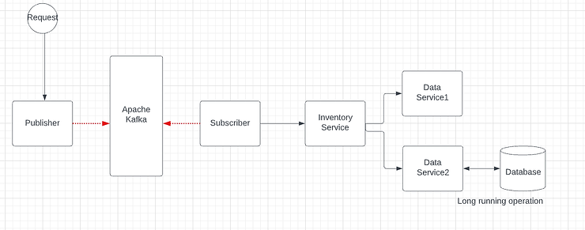

# Distributed tracing using Spring Cloud Sleuth, Zipkin and Kafka

This article provides details about how to trace the messages exchanged between services in a distributed architecture by using **Spring Cloud Sleuth** and **Zipkin server**.

This sample project has 5 **microservices**: an HTTP request triggers the Publisher and the Subscriber services to produce and consume an event via the Kafka cluster. 

When the event it is consumed it triggers additional requests to the rest of the services; the last web service simulates a slow operation by adding a randomized value for a timer.

Details about this project can be read in my blog's article from here: 
[ideliverSoft.com Article](https://www.ideliversoft.com/post/distributed-tracing-using-spring-cloud-sleuth-zipkin-and-kafka)

